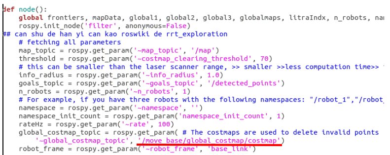
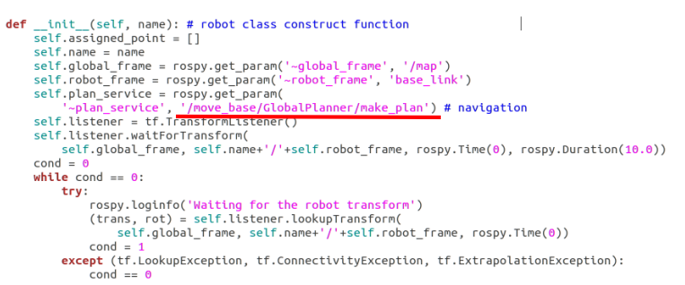
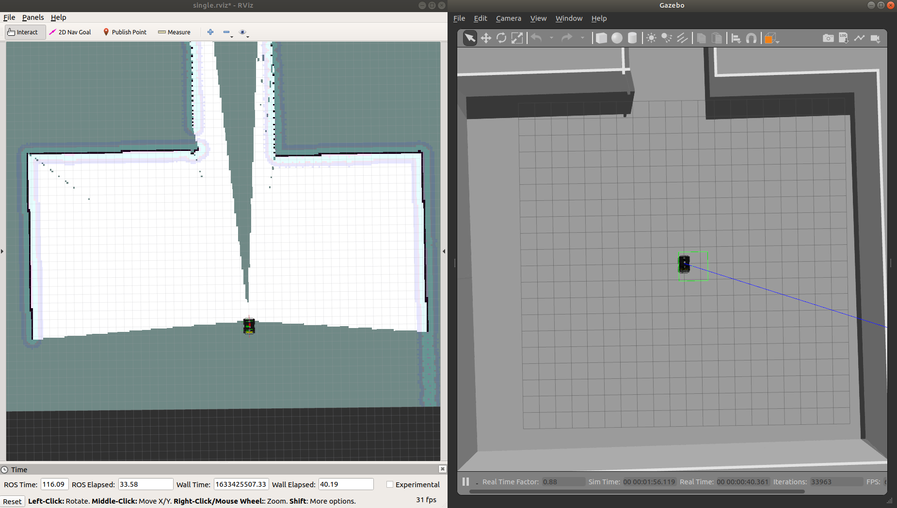
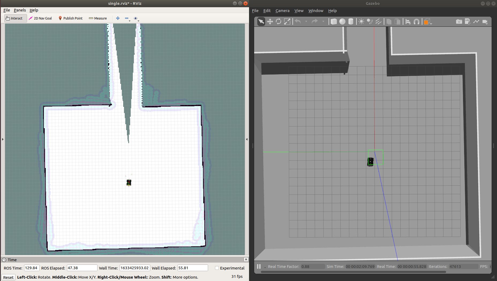
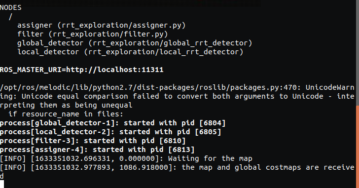
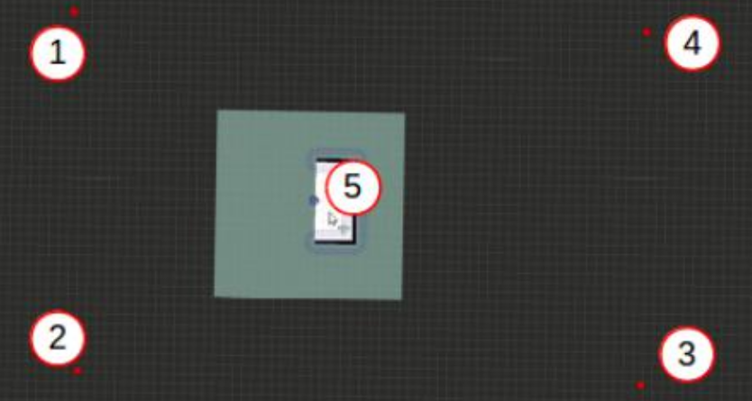
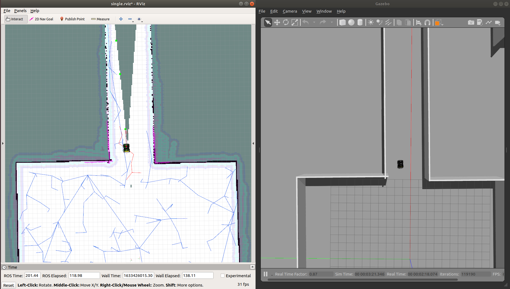

# 自主探索基线算法教程

## 目录

- ### 准备工作

- ### 例程使用

## 1.准备工作

首先，参考 http://wiki.ros.org/rrt_exploration/Tutorials 使用命令行安装 gmapping、
navigation、python 组件等依赖：

`$ sudo apt-get install ros-melodic-gmapping ros-melodic-navigation`

`$ ros-melodic-kobuki ros-melodic-kobuki-core ros-melodic-kobuki-gazebo`

`$ sudo apt-get install python-opencv python-numpy python-scikits-learn`

这里注意 melodic 的 kobuki 需要使用源码安装, 安装方法如下:

安装依赖:

`$ sudo apt-get install ros-melodic-kobuki-*`

`$ sudo apt-get install ros-melodic-ecl-streams`

`$ sudo apt-get install libusb-dev`

`$ sudo apt-get install libspnav-dev`

`$ sudo apt-get install ros-melodic-joystick-drivers`

`$ sudo apt-get install bluetooth`

`$ sudo apt-get install libbluetooth-dev`

`$ sudo apt-get install libcwiid-dev`

安装贝叶斯滤波器库：

`$ sudo apt-get install ros-melodic-bfl`

接下来，https://github.com/qingchen-bi/kobuki-package.git 下载 kobuki_package,
解压到 catkin_ws/src 目录下,编译工作空间。

最后，再安装 rrt_exploration 和 rrt_exploration_tutorials 两个功能包,我们只需要下载两个功能包到刚刚安装 kobuki 的工作空间下即可:

`$ cd ~/catkin_ws/src/`

`$ git clone https://github.com/hasauino/rrt_exploration.git`

`$ git clone https://github.com/hasauino/rrt_exploration_tutorials.git`

`$ cd ~/catkin_ws`

`$ catkin_make`

安装过程中可能遇到的问题对应的解决方法见下面链接 PDF 文件的附录部分，如果此教程不能成功安装 kobuki 功能包见下面的链接 PDF 文件的附录部分：

https://github.com/qingchen-bi/CNSubTExploration

## 2.例程使用

参考网址 http://wiki.ros.org/rrt_exploration/Tutorials/singleRobot 我们就可以运行基线算法进行单机器人探索。

首先，我们需要修改两个 python 文件，如下：

### 1.修改 rrt_exploration/scripts/filter.py

将下图中的红线部分修改为 '/move_base/global_costmap/costmap' ，即对应 move_base 启动节点中（[move_baseSafe_teb_husky.launch](https://github.com/qingchen-bi/CNSubTRobotSetupForExploration/blob/master/move_baseSafe_teb_husky.launch)）设置的 move_base 的名称

### 2.修改 rrt_exploration/scripts/functions.py

将下图中的红线部分修改为 '/move_base/GlobalPlanner/make_plan'，即对应 move_base 启动节点中（[move_baseSafe_teb_husky.launch](https://github.com/qingchen-bi/CNSubTRobotSetupForExploration/blob/master/move_baseSafe_teb_husky.launch)）设置的move_base 的名称以及使用的全局规划器名称

接下来运行以下命令：

`$ roslaunch husky_exploration single_exploration_husky.launch`

等待加载出 husky 机器人以及隧道模型，如图所示：

然后，通过点击 RVIZ 的 2D Nav Goal 使机器人在初始位置附近旋转，直到完全扫描到机器人初始位置附近的区域。 如下图所示：

最后，运行如下命令：

`$ roslaunch rrt_exploration single.launch`

如下图所示，提示已经接收到地图数据，说明一切正常，

然后我们点击 RVIZ 中的 Publish Point 选项,依次在 RVIZ 的左上角、左下角、右下角、右上角定义机器人的初始探索区域范围,最后点击中心位置,定义全局探索 rrt 树的初始生长点,随后机器人便开始运行。 使用 Publish Point 定义探索区域范围以及设置初始生长点的示意图如下所示：

如下图机器人能够启动，并开始自主探索。

运行过程中可能出现的错误解决方法见下面链接的 PDF 文件附录部分。

https://github.com/qingchen-bi/CNSubTExploration

